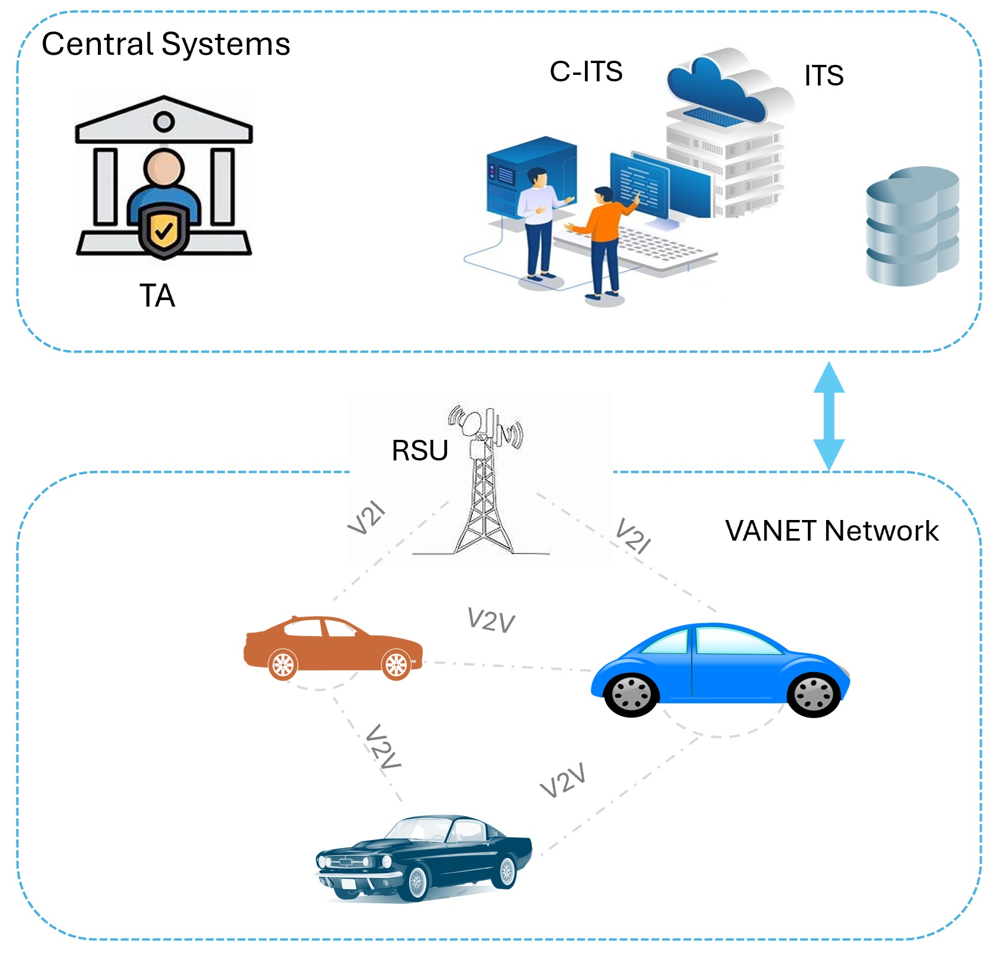

# LMGS - Lattice-based Multi-signature Group Scheme

[](LICENSE)
[](https://www.python.org/downloads/)

This repository implements a lattice-based group signature scheme for vehicular networks using zero-knowledge proofs (ZKP). The system enables anonymous vehicle authentication and collaborative threshold-based endorsements for secure V2X (Vehicle-to-Everything) communications.

## 📋 Table of Contents

- [Overview](#overview)
- [System Architecture](#system-architecture)
- [Key Features](#key-features)
- [⚠️ Demonstration vs Real-World Deployment](#️-demonstration-vs-real-world-deployment)
- [Installation](#installation)
- [Usage](#usage)
- [Scripts Overview](#scripts-overview)
- [Technical Details](#technical-details)
- [Security Properties](#security-properties)
- [Configuration](#configuration)
- [File Structure](#file-structure)
- [Contributing](#contributing)
- [License](#license)
- [Citation](#citation)

## Overview

This repository provides a complete cryptographic signature system for vehicular networks using zero-knowledge proofs. The implementation includes:

- **Anonymous Group Signatures**: Vehicles generate signatures without revealing their identity
- **Threshold-Based Endorsement**: Multiple vehicles collaboratively authenticate events via RSU verification
- **Lattice-Based Security**: Post-quantum secure cryptography using the LaZer framework
- **ITS-Compliant**: Optimized for Intelligent Transportation Systems with packet fragmentation

The system demonstrates how vehicles can generate anonymous signatures that are verified by a Road Side Unit (RSU) to meet a threshold requirement for collaborative authentication scenarios.

## System Architecture



The system consists of three main entities:

1. **Vehicles**: Generate anonymous signatures using private group signature keys
2. **Central System (CS)**: 
   - Trusted Authority (TA): Generates and distributes cryptographic keys
   - Application Servers (AS): Receive and analysis announcments and disseminate them. 
   - Tracing Entity (TE): Manage tracing of malicious vehicle
3. **Roadside Units (RSU)**: Verify signatures and enforce threshold requirements

### Operational Modes

**Mode 1: Basic Group Signatures**
- Individual vehicle signature generation and verification
- Single-signature authentication scenarios

**Mode 2: Threshold-Based Endorsement**
- Collaborative signature verification requiring multiple vehicles
- RSU aggregates and verifies signatures until threshold is met
- Optimized for bandwidth-constrained V2X networks

## Key Features

✅ **Post-Quantum Security**: Lattice-based cryptography resistant to quantum attacks  
✅ **Perfect Anonymity**: Vehicle identity never revealed in signatures  
✅ **Threshold Enforcement**: Requires ≥ t valid signatures from different vehicles  
✅ **Optimized Transmission**: 15× reduction in signature size (1300 KB → 85 KB)  
✅ **ITS Compliant**: Respects 2 KB packet size limits with automatic fragmentation  
✅ **Real-time Verification**: Immediate signature verification upon receipt  
✅ **Network Simulation**: Configurable delay models for testing

## ⚠️ Demonstration vs Real-World Deployment

### 🔬 Demonstration Setup (Current Implementation)

**In the threshold demonstration code:**
```
Test Signer → generates 20 signatures → sends to RSU
Total: 1 signer × 20 signatures = 20 signatures
```

This approach is used **purely for testing and benchmarking** to measure:
- ✓ Average signature generation time
- ✓ Network transmission performance  
- ✓ Verification latency
- ✓ System throughput

**Why demonstrate this way?**
- Simplifies testing without coordinating multiple machines/vehicles
- Provides consistent, reproducible performance measurements
- Easier to debug and optimize cryptographic operations
- Shows the system can handle the required threshold with margin

### 🚗 Real-World Deployment

**In actual vehicular networks:**
```
Vehicle 1  → generates 1 signature → sends to RSU
Vehicle 2  → generates 1 signature → sends to RSU
Vehicle 3  → generates 1 signature → sends to RSU
...
Vehicle 20 → generates 1 signature → sends to RSU
Total: 20 vehicles × 1 signature each = 20 signatures
```

## Installation

### Prerequisites

- Python 3.10 or higher
- GCC compiler (for LaZer library)
- Git

### 1. Clone the Repository

```bash
git clone https://github.com/yourusername/LMGS.git
cd LMGS
```

### 2. Install LaZer Library

The system requires the **LaZer** lattice-based zero-knowledge proof library:

```bash
# Clone LaZer repository
git clone https://github.com/lazer-crypto/lazer
cd lazer

# Follow installation instructions from LaZer documentation
# https://github.com/lazer-crypto/lazer
```

### 3. Generate Parameters

```bash
python GS_merged_params.py
```

This generates the `.h` parameter files needed for signing and verification.

## Usage

### Basic Group Signatures

**Generate and verify a single signature:**
```bash
python Group_sig_unified.py
```

**Performance testing (1000 iterations):**
```bash
python Group_sig_unified1000.py
```

### Threshold-Based Endorsement System

**Step 1: Start the RSU Verifier**
```bash
python Vehicle_verification_networked.py
```

The RSU will:
- Listen on port 9000
- Accept incoming signatures
- Verify each signature immediately
- Stop after threshold is met

**Step 2: Run the Vehicle Signer**
```bash
python Vehicle_signer_one_by_one.py
```

The signer will:
- Generate signatures with encryption + commitment components
- Fragment into ITS packets (2 KB each)
- Simulate network delays
- Transmit to RSU
- Display timing statistics

**Expected Output:**

```
[Signature 1/20]
  Step 1: Generating... Done (0.237s)
  Step 2: Sending with ITS fragmentation... ✓ Sent!
           Signature size: 85.2 KB (87245 bytes)
           ITS packets: 43 packets
           Total delay: 860.25ms
           Response: SIG_0_VERIFIED_VALID
```

## Scripts Overview

### Core Group Signature Scripts

| Script | Description |
|--------|-------------|
| `GS_merged_params.py` | Generates cryptographic parameters and public keys |
| `Group_sig_unified.py` | Basic signature generation and verification |
| `Group_sig_unified1000.py` | Performance benchmarking (1000 iterations) |

### Threshold Endorsement Scripts

| Script | Description |
|--------|-------------|
| `Vehicle_signer_one_by_one.py` | Vehicle-side signature generation with network simulation |
| `Vehicle_verification_networked.py` | RSU-side verification with threshold enforcement |

## Technical Details

### Cryptographic Scheme

**Signature Construction:**

The system uses a unified statement that combines:
1. **Encryption Component**: Vehicle encrypts identity using matrix $\mathbf{A}_{enc}$
2. **Signature Component**: Proves knowledge of secret keys satisfying:

$$
[\mathbf{A} \mid \mathbf{B} + id_i \mathbf{G} \mid \mathbf{B}'] 
\begin{bmatrix}
\mathbf{s}_1^{(i)}\\ 
\mathbf{s}_2^{(i)}\\ 
\mathbf{s}_3^{(i)}
\end{bmatrix} = \mathbf{u}
$$

3. **Commitment Component**: Commitment to signature elements
4. **Zero-Knowledge Proof**: LaZer proof of correctness

**Parameters:**
- Polynomial ring: $\mathcal{R}_q$ with degree 512
- Security parameter: $N = 8$, $M = 3$, $\tau = 5$
- Modulus: $q \approx 2^{42}$

### Key Generation

The Trusted Authority (TA) generates:
- Public matrices: $\mathbf{A}, \mathbf{B}, \mathbf{G}, \mathbf{B}'$
- Vehicle secret keys: $(s_1^{(i)}, s_2^{(i)}, s_3^{(i)}, id_i)$ for each vehicle $i$

All public parameters are deterministically derived from public randomness, enabling:
- ✓ Statement reconstruction at verifier
- ✓ Minimal transmission overhead (proof only)
- ✓ Consistent verification across all RSUs

## Security Properties

### 🔒 Privacy
- Vehicle identity ($id_i$) is **never revealed** in signatures
- Encryption ensures identity confidentiality
- Zero-knowledge proofs guarantee no information leakage
- Anonymous group membership

### ✓ Authenticity  
- Only legitimate vehicles with valid secret keys can generate signatures
- Cryptographic binding of identity to signature
- Unforgeable without knowledge of secret parameters
- Proof of group membership

### 🛡️ Threshold Security
- **Single vehicle cannot generate multiple valid signatures** (enforced cryptographically in real deployment)
- Requires genuine participation from ≥ $t$ different vehicles
- Prevents Sybil attacks where one adversary impersonates multiple vehicles
- Threshold $t$ adjustable based on security requirements

### 🔮 Post-Quantum Security
- Based on lattice-hard problems (Learning With Errors)
- Resistant to quantum computer attacks
- Future-proof cryptographic foundation

## Configuration

### Network Simulation

Edit `Vehicle_signer_one_by_one.py`:

```python
# Network delay configuration
NETWORK_CONFIG = "low_congestion"  # Options: "no_delay", "low_congestion", "high_congestion"

DELAY_CONFIGS = {
    "no_delay": {"mean": 0, "std": 0},
    "low_congestion": {"mean": 20, "std": 10},   # 20ms ± 10ms (Gaussian)
    "high_congestion": {"mean": 50, "std": 20},  # 50ms ± 20ms (Gaussian)
}
```

### Threshold Settings

Edit `Vehicle_verification_networked.py`:

```python
THRESHOLD = 10  # Number of valid signatures required for acceptance
```

### Test Parameters

Edit `Vehicle_signer_one_by_one.py`:

```python
NUM_SIGNATURES = 20  # For demonstration/testing only
                     # In production: each vehicle generates 1 signature
```

### ITS Packet Size

```python
ITS_MAX_PAYLOAD = 2048  # 2 KB per packet (ITS standard)
```

## File Structure

```
LMGS/
├── GS_merged_params.py              # Parameter generation script
├── Group_sig_unified.py             # Basic group signature operations
├── Group_sig_unified1000.py         # Performance benchmarking
├── Vehicle_signer_one_by_one.py     # Threshold signer (demonstration)
├── Vehicle_verification_networked.py # RSU verifier with threshold
├── lazer/                           # LaZer ZKP library
├── scheme.jpg                       # System architecture diagram
├── README.md                        # This file
├── LICENSE                          # License file
└── examples/                        # Example usage scripts
    ├── basic_signature.py
    └── threshold_demo.py
```

## Important Notes

1. **🚨 One Signature Per Vehicle**: In production deployment, cryptographic mechanisms ensure each vehicle can only generate **one valid signature per endorsement event**. The demonstration code generates multiple signatures for testing convenience only.

2. **🔄 Parameter Consistency**: Always use the same `.h` parameter file across signer and verifier. Re-run `GS_merged_params.py` if any cryptographic parameters change.

3. **🌐 Network Simulation**: The threshold scripts simulate network delays using `time.sleep()`. In real deployment, these would be actual V2X network transmission times.

4. **⚖️ Threshold Tuning**: The threshold value ($t$) should be chosen based on:
   - Security requirements (higher $t$ = more security)
   - Vehicle density in the area
   - Application criticality
   - Network conditions

5. **📡 ITS Compliance**: The system respects ITS packet size limits of 2048 bytes and handles fragmentation automatically.


## Citation

If you use this code in your research, please cite:

```bibtex
@software{lmgs2026,
  title = {LMGS: A Lattice-Based Message-Linkable Group Signature Scheme for Cooperative Intelligent Transportation Systems},
  author = {Amin Mohammadali, Riham AlTawy},
  year = {2026},
  url = {https://github.com/yourusername/LMGS}
}
```

## Acknowledgments

- **LaZer Library**: [github.com/lazer-crypto/lazer](https://github.com/lazer-crypto/lazer)
- Built on lattice-based cryptography research
- Designed for ITS and V2X communication standards

## Contact

- **Author**: Amin Mohammadali
- **Email**: aminmohammadali@gmail.com


---

**⭐ If you find this project useful, please consider giving it a star!**

**Last Updated**: February 2026
